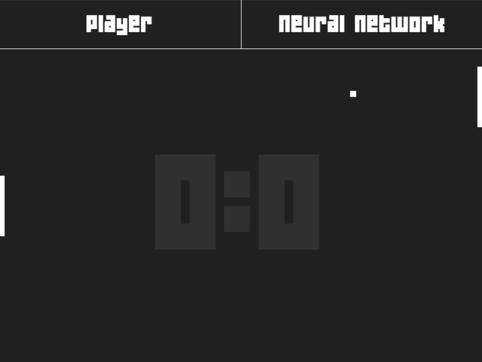
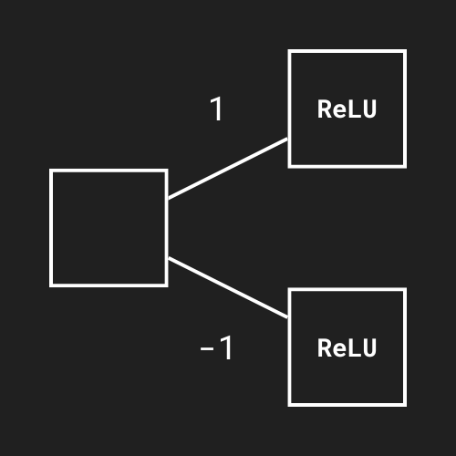
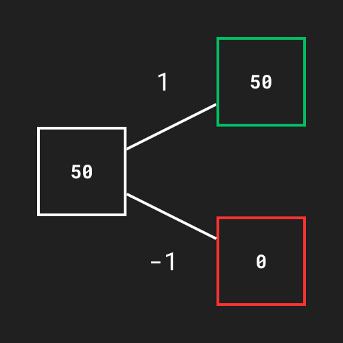

# Pong-IA

Jogo feito para estudar redes neurais.

<p align="center">
    
</p>

## Rede Neural

A rede neural usada foi uma rede do tipo **Feed Forward** com 2 camadas: entrada e saída. A Função de ativação usada foi a **ReLU**, por ser a mais comum. Não foram utilizados **bias** (viés) por ser uma rede extremamente simples.

<p align="center">
    
</p>

Ela não precisou ser treinada por ser extremamente simples.

Os pesos da rede são bem simples. No exemplo abaixo a bolinha se encontra a 50 pixel acima do player, então a rede recebe essa distância (Se a bolinha estivesse abaixo seria um valor negativo).

O valor de entrada é multiplicado pelos respectivos pesos e os neurônios de saída recebem o valor. Com a função de ativação **ReLU**, ao passar um valor positivo a função retornará o mesmo, porém com valores negativos a função retornará 0, ou seja, nesse caso, o player sobe.

<p align="center">
    
</p>

O arquivo [rede_neural.py](lib/rede_neural.py) contém a rede genérica. Ou seja, ela pode ser facilmente implementada em outros projetos.

## Requerimentos

O jogo foi feito utilizando a biblioteca `pygame`. Além dela, também foram necessários a utilização de outras bibliotecas que não são padrões do python, por isso é preciso que elas também sejam baixadas.

O comando para baixar todas as dependêncidas é:
```sh
pip install -r requirements.txt
```