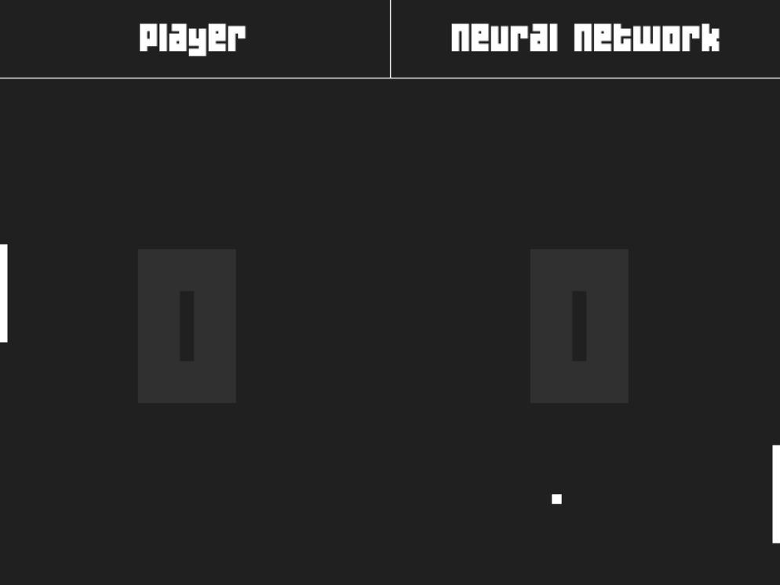

# Pong-IA

Jogo feito para estudar redes neurais.

<p align="center">
    
</p>

## Rede Neural

A rede neural usada foi uma rede do tipo **Feed Forward** com 2 camadas: entrada e saída. A Função de ativação usada foi a **ReLU**, por ser a mais comum. Não foram utilizados **bias** (viés) por ser uma rede extremamente simples.

Ela não precisou ser treinada por ser extremamente simples.

## Requerimentos

O jogo foi feito utilizando a biblioteca `pygame`. Além dela, também foram necessários a utilização de outras bibliotecas que não são padrões do python, por isso é preciso que elas também sejam baixadas.

O comando para baixar todas as dependêncidas é:
```sh
pip install -r requirements.txt
```